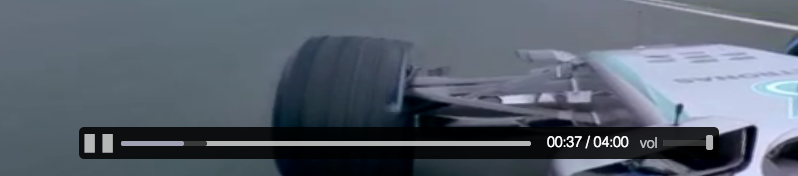

slant-player
===========

Slant video player component.



## install

```sh
$ component install littlstar/slant-player
```

## usage

```js
var Player = require('slant-player');
var el = document.querySelector('#player');
var player = new Player(el, {src: 'video.mp4'});

player.render();
```

## api

### Player (parent, opts)

```js
new Player(parent, {src: 'video.mp4'});
```

* `parent` - Parent DOM Element
* `opts` - Player options where an option is:
  * `width` - player width
  * `height` - player height
  * `src` - Video source
  * `controls` - [slant-controls](https://github.com/littlstar/slant-controls) options

### #play

Plays the video player

```js
player.play();
```

### #pause

Pauses the video player

```js
player.pause();
```

### #volume(level)

Sets the video player volume level

```js
player.volume(0.8);
```

### #mute

Muts the video player volume

```js
player.mute();
```

### #seek(seconds)

Seek to position in seconds

```js
player.seek(34);
```

### #use(fn)

Use a plugin with the player


```js
player.use(plugin());
```

### #show

Shows the video player

```js
player.show();
```

### #hide

Hides the video player

```js
player.hide();
```

### #render

Renders the video player in the DOM

```js
player.render();
```

### #destroy

Destroys the video player in view

```js
player.destroy();
```

## license

MIT
